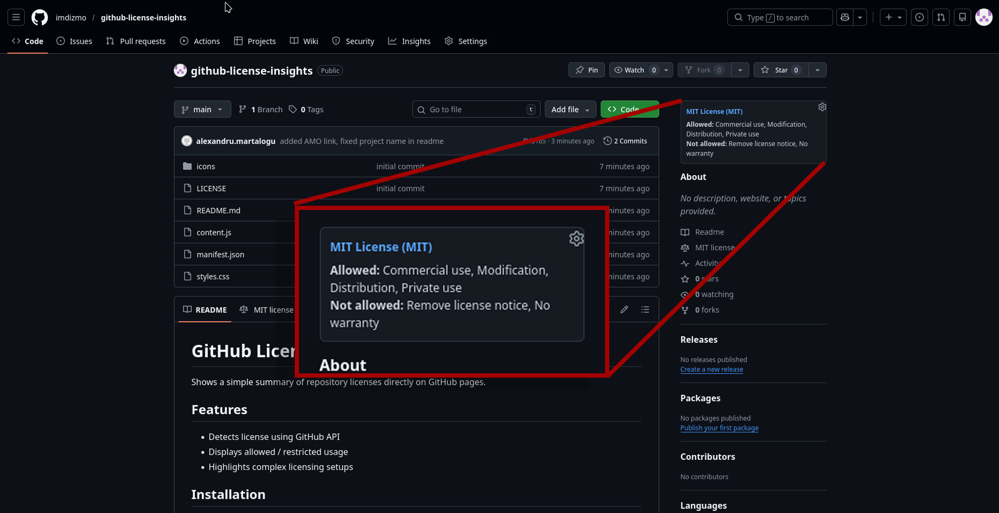

# GitHub License Insights

Shows a simple summary of repository licenses directly on GitHub pages.

## Features

- Detects license using GitHub API
- Displays allowed / restricted usage
- Highlights complex licensing setups

## Installation

### Firefox
Install from AMO ([link](https://addons.mozilla.org/en-US/firefox/addon/github-license-insights/))

## Screenshots

